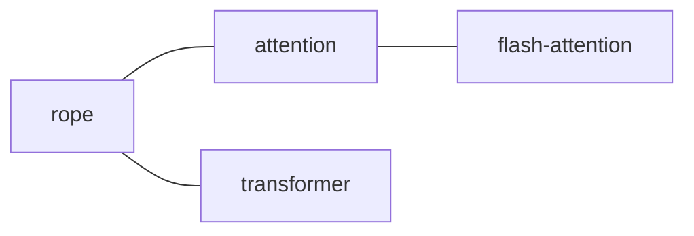

# 对话 → API 模式

把这些当作**配方**，而不是脚本。由智能体决定何时组合使用它们。每个示例都是纯 HTTP——挑选你环境里已有的任意客户端（`curl`、`fetch`、`requests` 等）。

---

## 跨平台说明（Windows / macOS / Linux）

下面的 bash + `curl` + `jq` 代码片段是为 **macOS / Linux** 编写的。在 **Windows** 上，请把它们转换成用户所处的对应 shell：

| bash 示例做的事 | PowerShell 等价写法 | cmd.exe 等价写法 |
|---|---|---|
| `$TOKEN` 环境变量 | `$env:LLM_WIKI_API_TOKEN` | `%LLM_WIKI_API_TOKEN%` |
| 对字符串做 URL 编码<br>`printf %s "$x" \| jq -sRr @uri` | `[System.Uri]::EscapeDataString($x)` | 用辅助函数 / `curl --data-urlencode` |
| `curl -s -H "Authorization: …"` | `curl.exe -s -H "Authorization: …"`（用 `curl.exe` 以避免 PowerShell 把 `curl` 别名为 `Invoke-WebRequest`） | `curl -s -H "Authorization: …"` |
| 行尾用反斜杠 `\` 续行 | 行尾用反引号 `` ` `` | 行尾用 `^` |

**Windows 上的路径**：

- 在 API 请求路径中始终传**正斜杠**（`wiki/concepts/foo.md`，绝不要 `wiki\concepts\foo.md`）。服务端以正斜杠形式存储并接受请求。
- 当把 Windows 文件系统路径用作 `{id}` 时（例如 `C:/Users/me/wiki`），要对**冒号**做百分号编码（`C%3A/Users/me/wiki`）。`EscapeDataString` / `encodeURIComponent` / `jq @uri` 都会正确处理这一点。
- 如果在 Windows 上以「路径作为 id」的调用返回 404，请退而求其次，改用 `GET /api/v1/projects`，并使用项目的 UUID——UUID 与平台无关，且不需要编码。

如果你是从 JavaScript / Python / Go / 任何其他带有真正 HTTP 客户端的语言（`fetch`、`requests`、`httpx`、`net/http`）发起调用，平台就无关紧要了——只需用 `encodeURIComponent` 或其等价物，然后忘掉那些 shell 上的怪癖即可。

---

## “我的 wiki 里关于 X 都说了些什么？”

这是最常见的单一诉求。工作流：

1. `POST /api/v1/projects/current/search`，带上 `{ query: X, topK: 5, includeContent: true }`。
2. **检查响应中的 `mode`**，以了解该如何解读分数（见下文）。
3. 如果靠前的结果明显高于其余结果（`score` 有较大差距），就读取这些结果并加以综合。否则读取前 3-5 条并合并。
4. **引用你用到的每一个 `path`。** 直接引用片段原文。
5. 如果什么都没找到（`results` 为空，或分布平坦、没有明显胜出者），就如实说明。**不要编造。**

```bash
curl -s -H "Authorization: Bearer $TOKEN" \
  -H 'Content-Type: application/json' \
  -d '{"query":"rope rotary position embedding","topK":5,"includeContent":true}' \
  $BASE/api/v1/projects/current/search
```

### 如何解读分数

分数的量纲取决于 `mode`：

| `mode` | 典型的最高 `score` | “好”长什么样 |
|---|---|---|
| `keyword` | 50–300+（累加式：文件名精确匹配 ≈ 200，标题中含短语 ≈ 50） | 最高结果与其余结果之间有明显差距（2 倍以上）。 |
| `hybrid` / `vector` | 0.015–0.035（RRF：基于 `1/(60+rank)`） | 最高 RRF 分数接近 `0.032` ≈ 在关键词和向量两路中都命中了 top-1。 |

**不要跨 mode 套用固定阈值。** 按 `score` 降序排序，并依赖相对差距。用 `vectorScore`（如果存在）来判断“语义匹配有多强”——它是 `[0, 1]` 区间内的原始相似度，比 RRF 更容易设阈值。

回答模板：

> 根据 `wiki/concepts/rope.md`（经 hybrid 匹配，vectorScore=0.94），rotary position embedding 的工作原理是按与位置成比例的角度旋转 Q 和 K 向量。你的 wiki 特别提到……

---

## “给我读读关于 X 的那一页”

用户想要全文，而不是综合摘要。

1. 如果用户给出的是类似 slug 的标识符（`rope`、`flash-attention`），先用 `topK: 1` 搜索以消歧。
2. `GET /api/v1/projects/current/files/content?path=wiki/concepts/rope.md`
3. 将内容渲染为 markdown。

```bash
PATH_REL="wiki/concepts/rope.md"
# url-encode path component
ENCODED=$(printf %s "$PATH_REL" | jq -sRr @uri)
curl -s -H "Authorization: Bearer $TOKEN" \
  "$BASE/api/v1/projects/current/files/content?path=$ENCODED"
```

在 JS 中：

```js
const encoded = encodeURIComponent("wiki/concepts/rope.md")
const r = await fetch(`${BASE}/api/v1/projects/current/files/content?path=${encoded}`, {
  headers: { Authorization: `Bearer ${TOKEN}` },
})
const { content } = await r.json()
```

---

## “哪些页面链接到 X？” / “给我看看 X 的邻域”

1. `GET /api/v1/projects/current/graph?limit=1000`——一次性拉取整张图（开销很小，典型项目下 < 1 MB）。
2. 找到 `nodes[i].id === X`（或用 label 子串匹配）。
3. 过滤 `edges`，取 `source === X || target === X`。另一端的端点就是邻居。

```bash
curl -s -H "Authorization: Bearer $TOKEN" "$BASE/api/v1/projects/current/graph?limit=1000"
```

你也可以让 API 替你过滤：

```bash
curl -s -H "Authorization: Bearer $TOKEN" "$BASE/api/v1/projects/current/graph?q=rope&limit=200"
```

这会对 `id` 或 `label` 应用子串过滤（不区分大小写），并返回匹配的子图，其中包含已匹配节点之间的边。

当用户想要可视化效果时，渲染一张小型 mermaid 图：



---

## “我的 wiki 里有什么？” / “给我一个概览”

两个切入角度：

**结构性概览**——文件树：

```bash
curl -s -H "Authorization: Bearer $TOKEN" \
  "$BASE/api/v1/projects/current/files?root=wiki&recursive=true&maxFiles=500"
```

总结目录结构（`concepts/`、`entities/`、`sources/`……）以及每个类别下大致的页面数量。

**主题性概览**——读取精心整理的索引：

```bash
for path in wiki/index.md wiki/overview.md purpose.md; do
  encoded=$(printf %s "$path" | jq -sRr @uri)
  curl -s -H "Authorization: Bearer $TOKEN" \
    "$BASE/api/v1/projects/current/files/content?path=$encoded"
  echo
done
```

用户的 `purpose.md` 描述了意图；`index.md` 列举了页面；`overview.md` 是 AI 生成的主题摘要。引用相关的片段。

---

## “我往源文件夹里加了新文档——重新索引”

1. `POST /api/v1/projects/current/sources/rescan`
2. 读回 `changedTasks`。报告：
   - “检测到 N 个新增 / M 个修改 / K 个删除的文件。”
   - 列出前约 5 个文件路径，以便用户核对。
3. 告诉用户**实际的摄入（ingest）**是通过桌面队列异步运行的——建议他们打开 Activity 面板查看进度。

```bash
curl -s -X POST -H "Authorization: Bearer $TOKEN" \
  "$BASE/api/v1/projects/current/sources/rescan"
```

如果 `changedTasks` 为空：

> 未检测到文件变更。如果你添加了文件但它们没有出现，请检查 `Settings → Source Watch`——你的过滤器可能把它们排除了（例如 `.json` 默认就被排除）。

---

## “找出所有提到 Y 的页面”（广泛扫荡）

搜索是带排序的（配置了 embeddings 时用 hybrid，否则用 keyword），且每次调用最多返回 50 条命中。对于**穷尽式**扫荡：

1. 用 `topK: 50` 和你的检索词运行 `POST .../search`。
2. 如果第 50 条结果的分数（相对于最高分）仍然不可忽略，就用更具体的查询再跑一次——API 单次调用不会返回超过 50 条。
3. 对于**精确字符串**扫荡，当关键词分词把你的短语弄乱时（例如 CJK 标点边界、带下划线的代码标识符），请遍历每一个 `wiki/*.md`，通过 `files` + `files/content` 在客户端 grep。慢，但可靠。
4. 纯语义扫荡：设置 `topK: 50`，并读取每条命中上的 `vectorScore`——没有 `vectorScore` 的页面仅通过关键词命中。

---

## “在我的 Reading 项目里搜索，而不是当前项目”

当用户指名了某个具体项目，而不是暗指当前活动项目时。

1. 列出项目以解析名称：

   ```bash
   curl -s -H "Authorization: Bearer $TOKEN" "$BASE/api/v1/projects"
   ```

   返回：
   ```json
   {
     "projects": [
       {"id":"abc-…","name":"Research Notes","path":"/Users/me/wiki/research","current":true},
       {"id":"def-…","name":"Reading","path":"/Users/me/wiki/reading","current":false}
     ]
   }
   ```

2. 匹配用户口述的名称。对 `name` 做不区分大小写的子串匹配：

   ```js
   const projects = (await (await fetch(`${BASE}/api/v1/projects`, {
     headers: { Authorization: `Bearer ${TOKEN}` },
   })).json()).projects
   const match = projects.filter(p => p.name.toLowerCase().includes("reading"))
   ```

3. 处理歧义：
   - **0 个匹配** → 告知用户，列出可用的名称，问他们要哪一个。不要默默回退到 `current`——那会回答错误的问题。
   - **1 个匹配** → 在本次对话后续的所有调用中使用它的 `id`。
   - **2 个及以上匹配** → 请用户消歧，同时展示 `name` + `path`。

4. 直接使用解析出来的 id：

   ```bash
   PROJECT_ID="def-…"   # from step 2
   curl -s -H "Authorization: Bearer $TOKEN" \
     -H 'Content-Type: application/json' \
     -d '{"query":"narrative voice","topK":5}' \
     "$BASE/api/v1/projects/$PROJECT_ID/search"
   ```

5. 在本次对话余下的过程中缓存该 `id`。不要每次调用都重新列出项目。仅当用户切换上下文时才重新解析（“现在改搜我的 Research 项目”）。

当用户以文件系统路径方式引用项目时，你也可以直接传该路径（经过 URL 编码）：

```bash
PROJECT_PATH=$(printf %s "/Users/me/wiki/reading" | jq -sRr @uri)
curl -s -H "Authorization: Bearer $TOKEN" \
  "$BASE/api/v1/projects/$PROJECT_PATH/files?root=wiki"
```

---

## “对比一下我的 Research 和 Reading 项目对 X 的说法”

用户想要跨项目综合。

1. `GET /api/v1/projects` 一次 → 取出两个 id。
2. 用同一个查询分别搜索每个项目：

   ```bash
   for ID in research-id reading-id; do
     curl -s -H "Authorization: Bearer $TOKEN" \
       -H 'Content-Type: application/json' \
       -d '{"query":"narrative voice","topK":3,"includeContent":true}' \
       "$BASE/api/v1/projects/$ID/search"
   done
   ```

3. 对两组结果做差异 / 对比分析。**同时**引用项目名称和页面路径：*“在 Research Notes（`wiki/concepts/narrative.md`）中……而在 Reading（`wiki/concepts/voice.md`）中……”*。

`current` 仅指当前活动项目；对于多项目查询，请始终传入显式的 ID。

---

## “切换到项目 X”（对话进行中）

用户一直在询问当前活动项目，然后说“现在到我的 Reading 项目里查同一件事”。

1. 通过 `GET /api/v1/projects` 重新解析（若列表是最近获取的，可用缓存列表）。
2. 在本次对话余下的过程中替换你缓存的项目 id。
3. **在你的回复中确认一次此次切换**：*“正在切换到你的 Reading 项目……”*。不要默默执行。
4. 保留用户的查询——把它应用到新项目上。

桌面 UI 的活动项目**不会**仅因为你用了不同的 `{id}` 而改变——你那些限定到非当前 id 的 API 调用是只读的，不会影响用户的 UI 状态。

---

## 反模式

- **不要 `POST /chat`**——它会返回 501。请使用桌面聊天 UI，或用 wiki 内容作为上下文去调用你自己的 LLM。
- **不要用 maxFiles=1、maxFiles=2、…… 来对文件树分页**——这里没有 offset/cursor。请用更高的上限，或用 `root=` 过滤。
- **不要绕过 API 进行写操作。** 该 API 以读为主。直接通过文件系统写入 `wiki/**` 或 `raw/sources/**` 会绕过文件同步 watcher。请使用桌面 UI 的 Sources → Import 流程或摄入（ingest）管线。
- **不要把 token 包含在你回显 / 记录 / 展示的 URL 中。** 在任何对用户可见的输出里都使用请求头。
- **不要在 429 / 503 时盲目重试**——请显式退避（分别为 1s / 2s）。
- **不要 shell out 去调一个封装脚本。** API 就是契约。直接的 `curl` / `fetch` 就是接口。

---

## 端到端实录

用户：*“我的 wiki 关于 flash attention 都说了什么？也把相关概念展示给我。”*

智能体（内部）：

```bash
# 1. health + auth pre-flight
curl -s "$BASE/api/v1/health"
# → tokenSource=store, enabled=true, authConfigured=true ✓

# 2. search
curl -s -H "Authorization: Bearer $TOKEN" -H 'Content-Type: application/json' \
  -d '{"query":"flash attention","topK":5,"includeContent":true}' \
  "$BASE/api/v1/projects/current/search"

# 3. graph filter for "flash-attention" neighborhood
curl -s -H "Authorization: Bearer $TOKEN" \
  "$BASE/api/v1/projects/current/graph?q=flash&limit=200"
```

智能体（对用户）：

> 正在查你的活动项目。搜索以 **hybrid 模式**运行（tokenHits=12, vectorHits=8）——最高命中 `wiki/concepts/flash-attention.md` 同时匹配了关键词和向量信号（`vectorScore=0.91`）。
>
> 你的 wiki 把 FlashAttention 解释为一种内存高效的精确 attention 实现，它对 QKV 矩阵分块（tile），以避免物化完整的 N×N attention 图。关键论断：**在 A100 上长上下文场景下提速 2-4 倍**（出自你的 wiki）。
>
> 你的图中相关的概念：
> - `wiki/concepts/attention.md`（父级）
> - `wiki/concepts/long-context.md`（同级，二者都可从 `flash-attention` 到达）
> - `wiki/entities/tri-dao.md`（被引用的作者）
>
> 需要我把其中任何一篇完整读给你听吗？
